# 🏗️ ToDoList — Complete Codebase Analysis & Improvement Blueprint

> **Generated:** December 28, 2025
> **Platform:** React Native Expo SDK 54
> **Health Score:** 15/100 🔴 CRITICAL
> **Status:** App is essentially a template with NO actual functionality

---

## 📋 Executive Summary

### 🚨 CRITICAL FINDING: README vs Reality Mismatch

**The README promises a fully-featured TodoList app, but the codebase is just the default Expo tabs template with ZERO actual functionality.**

| README Claims | Actual Implementation | Status |
|---------------|----------------------|--------|
| 🔐 Authentication with Supabase | ❌ Not implemented | 🔴 Missing |
| 📋 Task Management (CRUD) | ❌ Not implemented | 🔴 Missing |
| 🔔 Notifications | ❌ Not implemented | 🔴 Missing |
| 📊 Statistics | ❌ Not implemented | 🔴 Missing |
| 🌙 Aurora Design | ❌ Default Expo template | 🔴 Missing |
| Zustand State Management | ❌ Not in dependencies | 🔴 Missing |
| Supabase Backend | ❌ Not in dependencies | 🔴 Missing |

### Overall Assessment

1. **Codebase Health:** 🔴 CRITICAL - This is a skeleton project with no actual features
2. **UI/UX Quality:** 🔴 CRITICAL - Default template styling, no custom design
3. **Architecture:** 🟡 MEDIUM - Basic Expo Router structure is fine, but no business logic
4. **Integration Readiness:** 🔴 CRITICAL - No backend, no RevenueCat, no services
5. **Production Readiness:** 🔴 CRITICAL - Cannot be shipped in current state

### Top Priorities (Immediate Action Required)

1. **P0:** Implement actual TodoList functionality (the app literally does nothing)
2. **P0:** Add Supabase for backend/auth (as promised in README)
3. **P0:** Build the UI screens mentioned in README (tasks, add, stats, settings, login, register)
4. **P1:** Implement Aurora/Cosmic design system
5. **P1:** Add Zustand state management

---

## 🗂️ Project Structure Analysis

### Current File Tree (What Exists)
```
📦 todolist
├── 📂 app/                      # Expo Router screens
│   ├── 📂 (tabs)/               # Tab navigation
│   │   ├── _layout.tsx          # Tab layout (generic)
│   │   ├── index.tsx            # "Tab One" (placeholder)
│   │   └── two.tsx              # "Tab Two" (placeholder)
│   ├── _layout.tsx              # Root layout
│   ├── +html.tsx                # Web HTML template
│   ├── +not-found.tsx           # 404 screen
│   └── modal.tsx                # Modal (placeholder)
├── 📂 assets/
│   ├── 📂 fonts/
│   │   └── SpaceMono-Regular.ttf
│   └── 📂 images/
│       ├── adaptive-icon.png
│       ├── favicon.png
│       ├── icon.png
│       └── splash-icon.png
├── 📂 components/               # Basic template components
│   ├── 📂 __tests__/
│   │   └── StyledText-test.js
│   ├── EditScreenInfo.tsx       # Template help component
│   ├── ExternalLink.tsx         # Link wrapper
│   ├── StyledText.tsx           # Monospace text
│   ├── Themed.tsx               # Theme-aware Text/View
│   ├── useClientOnlyValue.ts    # SSR helper
│   ├── useClientOnlyValue.web.ts
│   ├── useColorScheme.ts        # Theme hook
│   └── useColorScheme.web.ts
├── 📂 constants/
│   └── Colors.ts                # Basic color palette
├── .gitignore
├── .vscode/
├── app.json                     # Expo config
├── package.json
├── package-lock.json
├── README.md                    # Promises features that don't exist!
└── tsconfig.json
```

### What README Says Should Exist (But Doesn't!)
```
📦 todolist (EXPECTED)
├── 📂 app/
│   ├── 📂 (tabs)/
│   │   ├── index.tsx            ❌ Should be Home, is "Tab One"
│   │   ├── tasks.tsx            ❌ MISSING - Task list screen
│   │   ├── add.tsx              ❌ MISSING - Add task screen
│   │   ├── stats.tsx            ❌ MISSING - Statistics screen
│   │   └── settings.tsx         ❌ MISSING - Settings screen
│   ├── login.tsx                ❌ MISSING - Login screen
│   └── register.tsx             ❌ MISSING - Register screen
├── 📂 src/
│   ├── 📂 components/
│   │   ├── 📂 ui/               ❌ MISSING - No UI components
│   │   └── 📂 features/         ❌ MISSING - No feature components
│   ├── 📂 stores/               ❌ MISSING - No Zustand stores
│   ├── 📂 services/             ❌ MISSING - No services
│   └── 📂 constants/            ❌ MISSING - No proper config
└── 📂 supabase/
    └── schema.sql               ❌ MISSING - No database schema
```

### Architecture Diagram (Current State)


### Target Architecture (What Should Be Built)

```mermaid
graph TB
    subgraph Presentation["🎨 Presentation Layer"]
        subgraph Auth["Auth Screens"]
            Login[Login]
            Register[Register]
        end
        subgraph Tabs["Tab Screens"]
            Home[Home/Dashboard]
            Tasks[Task List]
            AddTask[Add Task]
            Stats[Statistics]
            Settings[Settings]
        end
        subgraph Modals["Modals"]
            TaskDetail[Task Detail]
            Paywall[Paywall]
        end
    end

    subgraph UI["🧩 UI Components"]
        Button[Button]
        Input[Input]
        Card[TaskCard]
        Modal[Modal]
        Toast[Toast]
    end

    subgraph Business["⚙️ Business Logic"]
        AuthStore[authStore]
        TaskStore[taskStore]
        SettingsStore[settingsStore]
        useNotifications[useNotifications]
    end

    subgraph Data["💾 Data Layer"]
        SupabaseClient[Supabase Client]
        AuthService[Auth Service]
        TaskService[Task Service]
        LocalStorage[AsyncStorage]
    end

    subgraph External["🌐 External Services"]
        Supabase[(Supabase)]
        RevenueCat[RevenueCat]
        PushNotifications[Expo Notifications]
    end

    Login --> AuthStore
    Register --> AuthStore
    Tasks --> TaskStore
    AddTask --> TaskStore
    Stats --> TaskStore

    AuthStore --> AuthService
    TaskStore --> TaskService
    AuthService --> SupabaseClient
    TaskService --> SupabaseClient
    SupabaseClient --> Supabase

    Settings --> RevenueCat
    Paywall --> RevenueCat
```



---

## 📁 File-by-File Analysis

---

### 📄 package.json
**Path:** `/package.json`
**Purpose:** Project dependencies and scripts
**Health:** 🔴 CRITICAL - Missing essential dependencies

**Current Implementation:**
```json
{
  "name": "todolist",
  "main": "expo-router/entry",
  "version": "1.0.0",
  "dependencies": {
    "@expo/vector-icons": "^15.0.3",
    "@react-navigation/native": "^7.1.8",
    "expo": "~54.0.30",
    "expo-constants": "~18.0.12",
    "expo-font": "~14.0.10",
    "expo-linking": "~8.0.11",
    "expo-router": "~6.0.21",
    "expo-splash-screen": "~31.0.13",
    "expo-status-bar": "~3.0.9",
    "expo-web-browser": "~15.0.10",
    "react": "19.1.0",
    "react-dom": "19.1.0",
    "react-native": "0.81.5",
    "react-native-worklets": "0.5.1",
    "react-native-reanimated": "~4.1.1",
    "react-native-safe-area-context": "~5.6.0",
    "react-native-screens": "~4.16.0",
    "react-native-web": "~0.21.0"
  },
  "devDependencies": {
    "@types/react": "~19.1.0",
    "react-test-renderer": "19.1.0",
    "typescript": "~5.9.2"
  }
}
```

**Issues Found:**

| # | Issue | Severity | Description |
|---|-------|----------|-------------|
| 1 | Missing Supabase | 🔴 Critical | README claims Supabase but it's not installed |
| 2 | Missing Zustand | 🔴 Critical | README claims Zustand but it's not installed |
| 3 | Missing expo-notifications | 🔴 Critical | README claims notifications but no package |
| 4 | Missing expo-secure-store | 🟡 Medium | Needed for secure token storage |
| 5 | Missing @react-native-async-storage | 🟡 Medium | Needed for local persistence |
| 6 | Missing expo-haptics | 🟡 Medium | Needed for tactile feedback |
| 7 | Missing expo-image | 🟡 Medium | Better performance than Image |
| 8 | Missing @shopify/flash-list | 🟡 Medium | Better performance than FlatList |
| 9 | Missing react-native-gesture-handler | 🟡 Medium | Needed for gesture interactions |
| 10 | No testing framework | 🟡 Medium | Only react-test-renderer, no Jest config |
| 11 | No linting setup | 🟢 Low | Missing ESLint/Prettier |
| 12 | No pre-commit hooks | 🟢 Low | Missing husky/lint-staged |

**Recommended Fix:**
```json
{
  "name": "todolist",
  "main": "expo-router/entry",
  "version": "1.0.0",
  "scripts": {
    "start": "expo start",
    "android": "expo start --android",
    "ios": "expo start --ios",
    "web": "expo start --web",
    "test": "jest",
    "lint": "eslint . --ext .ts,.tsx",
    "lint:fix": "eslint . --ext .ts,.tsx --fix",
    "typecheck": "tsc --noEmit"
  },
  "dependencies": {
    "@expo/vector-icons": "^15.0.3",
    "@react-navigation/native": "^7.1.8",
    "@shopify/flash-list": "^2.0.0",
    "@supabase/supabase-js": "^2.45.0",
    "expo": "~54.0.30",
    "expo-constants": "~18.0.12",
    "expo-font": "~14.0.10",
    "expo-haptics": "~14.0.1",
    "expo-image": "~2.0.4",
    "expo-linking": "~8.0.11",
    "expo-notifications": "~0.30.0",
    "expo-router": "~6.0.21",
    "expo-secure-store": "~14.0.1",
    "expo-splash-screen": "~31.0.13",
    "expo-status-bar": "~3.0.9",
    "expo-web-browser": "~15.0.10",
    "react": "19.1.0",
    "react-dom": "19.1.0",
    "react-native": "0.81.5",
    "react-native-gesture-handler": "~2.21.0",
    "react-native-reanimated": "~4.1.1",
    "react-native-safe-area-context": "~5.6.0",
    "react-native-screens": "~4.16.0",
    "react-native-web": "~0.21.0",
    "react-native-worklets": "0.5.1",
    "zustand": "^5.0.0"
  },
  "devDependencies": {
    "@testing-library/react-native": "^12.4.0",
    "@types/react": "~19.1.0",
    "eslint": "^8.57.0",
    "eslint-config-expo": "^8.0.0",
    "jest": "^29.7.0",
    "jest-expo": "~52.0.0",
    "prettier": "^3.2.0",
    "react-test-renderer": "19.1.0",
    "typescript": "~5.9.2"
  }
}
```

---

### 📄 app.json
**Path:** `/app.json`
**Purpose:** Expo app configuration
**Health:** 🟡 NEEDS WORK

**Current Implementation:**
```json
{
  "expo": {
    "name": "ToDoList",
    "slug": "ToDoList",
    "version": "1.0.0",
    "orientation": "portrait",
    "icon": "./assets/images/icon.png",
    "scheme": "todolist",
    "userInterfaceStyle": "automatic",
    "newArchEnabled": true,
    "splash": {
      "image": "./assets/images/splash-icon.png",
      "resizeMode": "contain",
      "backgroundColor": "#ffffff"
    },
    "ios": {
      "supportsTablet": true
    },
    "android": {
      "adaptiveIcon": {
        "foregroundImage": "./assets/images/adaptive-icon.png",
        "backgroundColor": "#ffffff"
      },
      "edgeToEdgeEnabled": true
    },
    "web": {
      "bundler": "metro",
      "output": "static",
      "favicon": "./assets/images/favicon.png"
    },
    "plugins": [
      "expo-router"
    ],
    "experiments": {
      "typedRoutes": true
    }
  }
}
```

**Issues Found:**

| # | Issue | Severity | Line |
|---|-------|----------|------|
| 1 | Missing iOS bundleIdentifier | 🔴 Critical | ios section |
| 2 | Missing Android package | 🔴 Critical | android section |
| 3 | Missing notification permissions | 🔴 Critical | plugins section |
| 4 | Splash backgroundColor should match Aurora theme | 🟡 Medium | L14 |
| 5 | Missing EAS project ID | 🟡 Medium | - |
| 6 | Missing updates configuration | 🟡 Medium | - |
| 7 | No app privacy manifest | 🟡 Medium | ios section |

**Recommended Fix:**
```json
{
  "expo": {
    "name": "ToDoList",
    "slug": "ToDoList",
    "version": "1.0.0",
    "orientation": "portrait",
    "icon": "./assets/images/icon.png",
    "scheme": "todolist",
    "userInterfaceStyle": "automatic",
    "newArchEnabled": true,
    "splash": {
      "image": "./assets/images/splash-icon.png",
      "resizeMode": "contain",
      "backgroundColor": "#0a0a1a"
    },
    "ios": {
      "supportsTablet": true,
      "bundleIdentifier": "com.yourcompany.todolist",
      "infoPlist": {
        "NSCameraUsageDescription": "Allow ToDoList to access camera for profile photos",
        "UIBackgroundModes": ["remote-notification"]
      }
    },
    "android": {
      "adaptiveIcon": {
        "foregroundImage": "./assets/images/adaptive-icon.png",
        "backgroundColor": "#0a0a1a"
      },
      "package": "com.yourcompany.todolist",
      "edgeToEdgeEnabled": true,
      "permissions": [
        "RECEIVE_BOOT_COMPLETED",
        "VIBRATE",
        "SCHEDULE_EXACT_ALARM"
      ]
    },
    "web": {
      "bundler": "metro",
      "output": "static",
      "favicon": "./assets/images/favicon.png"
    },
    "plugins": [
      "expo-router",
      [
        "expo-notifications",
        {
          "icon": "./assets/images/notification-icon.png",
          "color": "#7c3aed"
        }
      ],
      "expo-secure-store"
    ],
    "experiments": {
      "typedRoutes": true
    },
    "extra": {
      "eas": {
        "projectId": "your-project-id"
      }
    },
    "updates": {
      "url": "https://u.expo.dev/your-project-id"
    },
    "runtimeVersion": {
      "policy": "appVersion"
    }
  }
}
```

---

### 📄 constants/Colors.ts
**Path:** `/constants/Colors.ts`
**Purpose:** Color definitions for theming
**Health:** 🔴 CRITICAL - Extremely minimal, no Aurora design

**Current Implementation:**
```typescript
const tintColorLight = '#2f95dc';
const tintColorDark = '#fff';

export default {
  light: {
    text: '#000',
    background: '#fff',
    tint: tintColorLight,
    tabIconDefault: '#ccc',
    tabIconSelected: tintColorLight,
  },
  dark: {
    text: '#fff',
    background: '#000',
    tint: tintColorDark,
    tabIconDefault: '#ccc',
    tabIconSelected: tintColorDark,
  },
};
```

**Issues Found:**

| # | Issue | Severity | Line |
|---|-------|----------|------|
| 1 | Not an Aurora/Cosmic design | 🔴 Critical | All |
| 2 | Only 5 colors defined | 🔴 Critical | All |
| 3 | No spacing system | 🔴 Critical | - |
| 4 | No typography scale | 🔴 Critical | - |
| 5 | No border radius tokens | 🟡 Medium | - |
| 6 | No shadow/elevation tokens | 🟡 Medium | - |
| 7 | No animation tokens | 🟡 Medium | - |
| 8 | No semantic colors (success, error, warning) | 🔴 Critical | - |
| 9 | Using generic blue instead of Aurora purple/violet | 🟡 Medium | L1 |

**Recommended Fix:** See Design Tokens section below for complete implementation.

---

### 📄 app/_layout.tsx
**Path:** `/app/_layout.tsx`
**Purpose:** Root layout with theme provider and font loading
**Health:** 🟡 NEEDS WORK

**Current Implementation:**
```tsx
import FontAwesome from '@expo/vector-icons/FontAwesome';
import { DarkTheme, DefaultTheme, ThemeProvider } from '@react-navigation/native';
import { useFonts } from 'expo-font';
import { Stack } from 'expo-router';
import * as SplashScreen from 'expo-splash-screen';
import { useEffect } from 'react';
import 'react-native-reanimated';

import { useColorScheme } from '@/components/useColorScheme';

export {
  ErrorBoundary,
} from 'expo-router';

export const unstable_settings = {
  initialRouteName: '(tabs)',
};

SplashScreen.preventAutoHideAsync();

export default function RootLayout() {
  const [loaded, error] = useFonts({
    SpaceMono: require('../assets/fonts/SpaceMono-Regular.ttf'),
    ...FontAwesome.font,
  });

  useEffect(() => {
    if (error) throw error;
  }, [error]);

  useEffect(() => {
    if (loaded) {
      SplashScreen.hideAsync();
    }
  }, [loaded]);

  if (!loaded) {
    return null;
  }

  return <RootLayoutNav />;
}

function RootLayoutNav() {
  const colorScheme = useColorScheme();

  return (
    <ThemeProvider value={colorScheme === 'dark' ? DarkTheme : DefaultTheme}>
      <Stack>
        <Stack.Screen name="(tabs)" options={{ headerShown: false }} />
        <Stack.Screen name="modal" options={{ presentation: 'modal' }} />
      </Stack>
    </ThemeProvider>
  );
}
```

**Issues Found:**

| # | Issue | Severity | Line |
|---|-------|----------|------|
| 1 | No auth state check | 🔴 Critical | L48-58 |
| 2 | No Zustand/state provider | 🔴 Critical | - |
| 3 | No notification setup | 🔴 Critical | - |
| 4 | Using default themes instead of Aurora | 🟡 Medium | L52 |
| 5 | No gesture handler provider | 🟡 Medium | - |
| 6 | No safe area provider (already in Expo) | 🟢 Low | - |
| 7 | Missing auth routes (login, register) | 🔴 Critical | L54-55 |
| 8 | No loading/splash animation | 🟡 Medium | L41 |

**Recommended Fix:**
```tsx
import FontAwesome from '@expo/vector-icons/FontAwesome';
import { ThemeProvider } from '@react-navigation/native';
import { useFonts } from 'expo-font';
import { Stack, useRouter, useSegments } from 'expo-router';
import * as SplashScreen from 'expo-splash-screen';
import * as Notifications from 'expo-notifications';
import { useEffect } from 'react';
import { GestureHandlerRootView } from 'react-native-gesture-handler';
import 'react-native-reanimated';

import { useAuthStore } from '@/stores/authStore';
import { AuroraTheme } from '@/constants/theme';

export { ErrorBoundary } from 'expo-router';

export const unstable_settings = {
  initialRouteName: '(tabs)',
};

// Configure notifications
Notifications.setNotificationHandler({
  handleNotification: async () => ({
    shouldShowAlert: true,
    shouldPlaySound: true,
    shouldSetBadge: true,
  }),
});

SplashScreen.preventAutoHideAsync();

function useProtectedRoute() {
  const { session, isLoading } = useAuthStore();
  const segments = useSegments();
  const router = useRouter();

  useEffect(() => {
    if (isLoading) return;

    const inAuthGroup = segments[0] === '(auth)';

    if (!session && !inAuthGroup) {
      router.replace('/login');
    } else if (session && inAuthGroup) {
      router.replace('/(tabs)');
    }
  }, [session, segments, isLoading]);
}

export default function RootLayout() {
  const [loaded, error] = useFonts({
    SpaceMono: require('../assets/fonts/SpaceMono-Regular.ttf'),
    ...FontAwesome.font,
  });

  useEffect(() => {
    if (error) throw error;
  }, [error]);

  useEffect(() => {
    if (loaded) {
      // Add slight delay for smooth transition
      setTimeout(() => SplashScreen.hideAsync(), 200);
    }
  }, [loaded]);

  if (!loaded) return null;

  return <RootLayoutNav />;
}

function RootLayoutNav() {
  useProtectedRoute();

  return (
    <GestureHandlerRootView style={{ flex: 1 }}>
      <ThemeProvider value={AuroraTheme}>
        <Stack screenOptions={{ headerShown: false }}>
          <Stack.Screen name="(auth)" />
          <Stack.Screen name="(tabs)" />
          <Stack.Screen
            name="modal"
            options={{
              presentation: 'modal',
              animation: 'slide_from_bottom',
            }}
          />
        </Stack>
      </ThemeProvider>
    </GestureHandlerRootView>
  );
}
```

---

### 📄 app/(tabs)/_layout.tsx
**Path:** `/app/(tabs)/_layout.tsx`
**Purpose:** Tab navigation layout
**Health:** 🔴 CRITICAL - Generic template, wrong tabs

**Current Implementation:**
```tsx
import React from 'react';
import FontAwesome from '@expo/vector-icons/FontAwesome';
import { Link, Tabs } from 'expo-router';
import { Pressable } from 'react-native';

import Colors from '@/constants/Colors';
import { useColorScheme } from '@/components/useColorScheme';
import { useClientOnlyValue } from '@/components/useClientOnlyValue';

function TabBarIcon(props: {
  name: React.ComponentProps<typeof FontAwesome>['name'];
  color: string;
}) {
  return <FontAwesome size={28} style={{ marginBottom: -3 }} {...props} />;
}

export default function TabLayout() {
  const colorScheme = useColorScheme();

  return (
    <Tabs
      screenOptions={{
        tabBarActiveTintColor: Colors[colorScheme ?? 'light'].tint,
        headerShown: useClientOnlyValue(false, true),
      }}>
      <Tabs.Screen
        name="index"
        options={{
          title: 'Tab One',
          tabBarIcon: ({ color }) => <TabBarIcon name="code" color={color} />,
          headerRight: () => (
            <Link href="/modal" asChild>
              <Pressable>
                {({ pressed }) => (
                  <FontAwesome
                    name="info-circle"
                    size={25}
                    color={Colors[colorScheme ?? 'light'].text}
                    style={{ marginRight: 15, opacity: pressed ? 0.5 : 1 }}
                  />
                )}
              </Pressable>
            </Link>
          ),
        }}
      />
      <Tabs.Screen
        name="two"
        options={{
          title: 'Tab Two',
          tabBarIcon: ({ color }) => <TabBarIcon name="code" color={color} />,
        }}
      />
    </Tabs>
  );
}
```

**Issues Found:**

| # | Issue | Severity | Line |
|---|-------|----------|------|
| 1 | Only 2 generic tabs instead of 5 per README | 🔴 Critical | L25-49 |
| 2 | Tab names are "Tab One" and "Tab Two" | 🔴 Critical | L29, L45 |
| 3 | Both tabs use same "code" icon | 🔴 Critical | L30, L46 |
| 4 | No haptic feedback on tab press | 🟡 Medium | - |
| 5 | No custom tab bar styling | 🟡 Medium | L21 |
| 6 | Pressable without proper press feedback | 🟡 Medium | L32 |
| 7 | Missing tasks, add, stats, settings tabs | 🔴 Critical | - |
| 8 | No blur/glass effect on tab bar | 🟡 Medium | - |

**Recommended Fix:**
```tsx
import React from 'react';
import { Tabs } from 'expo-router';
import { Platform, StyleSheet, View } from 'react-native';
import { BlurView } from 'expo-blur';
import * as Haptics from 'expo-haptics';
import Animated, {
  useAnimatedStyle,
  withSpring,
  interpolate,
} from 'react-native-reanimated';
import { Ionicons } from '@expo/vector-icons';

import { colors, spacing } from '@/constants/theme';

type IconName = React.ComponentProps<typeof Ionicons>['name'];

interface TabIconProps {
  name: IconName;
  color: string;
  focused: boolean;
}

function TabBarIcon({ name, color, focused }: TabIconProps) {
  const animatedStyle = useAnimatedStyle(() => ({
    transform: [
      { scale: withSpring(focused ? 1.1 : 1, { damping: 15 }) },
    ],
  }));

  return (
    <Animated.View style={animatedStyle}>
      <Ionicons name={name} size={24} color={color} />
    </Animated.View>
  );
}

function CustomTabBar(props: any) {
  return (
    <BlurView intensity={80} tint="dark" style={styles.tabBar}>
      {/* Render default tab bar content */}
    </BlurView>
  );
}

export default function TabLayout() {
  const handleTabPress = () => {
    Haptics.impactAsync(Haptics.ImpactFeedbackStyle.Light);
  };

  return (
    <Tabs
      screenOptions={{
        tabBarActiveTintColor: colors.primary[500],
        tabBarInactiveTintColor: colors.gray[400],
        tabBarStyle: styles.tabBar,
        tabBarLabelStyle: styles.tabLabel,
        headerShown: false,
        tabBarHideOnKeyboard: true,
      }}
      screenListeners={{
        tabPress: handleTabPress,
      }}
    >
      <Tabs.Screen
        name="index"
        options={{
          title: 'Home',
          tabBarIcon: ({ color, focused }) => (
            <TabBarIcon name={focused ? 'home' : 'home-outline'} color={color} focused={focused} />
          ),
        }}
      />
      <Tabs.Screen
        name="tasks"
        options={{
          title: 'Tasks',
          tabBarIcon: ({ color, focused }) => (
            <TabBarIcon name={focused ? 'list' : 'list-outline'} color={color} focused={focused} />
          ),
        }}
      />
      <Tabs.Screen
        name="add"
        options={{
          title: 'Add',
          tabBarIcon: ({ color, focused }) => (
            <View style={styles.addButton}>
              <Ionicons name="add" size={28} color={colors.white} />
            </View>
          ),
        }}
      />
      <Tabs.Screen
        name="stats"
        options={{
          title: 'Stats',
          tabBarIcon: ({ color, focused }) => (
            <TabBarIcon name={focused ? 'stats-chart' : 'stats-chart-outline'} color={color} focused={focused} />
          ),
        }}
      />
      <Tabs.Screen
        name="settings"
        options={{
          title: 'Settings',
          tabBarIcon: ({ color, focused }) => (
            <TabBarIcon name={focused ? 'settings' : 'settings-outline'} color={color} focused={focused} />
          ),
        }}
      />
    </Tabs>
  );
}

const styles = StyleSheet.create({
  tabBar: {
    position: 'absolute',
    backgroundColor: 'rgba(10, 10, 26, 0.9)',
    borderTopWidth: 0,
    elevation: 0,
    height: Platform.OS === 'ios' ? 88 : 68,
    paddingBottom: Platform.OS === 'ios' ? 28 : 8,
  },
  tabLabel: {
    fontSize: 11,
    fontWeight: '600',
  },
  addButton: {
    width: 56,
    height: 56,
    borderRadius: 28,
    backgroundColor: colors.primary[500],
    justifyContent: 'center',
    alignItems: 'center',
    marginBottom: 20,
    shadowColor: colors.primary[500],
    shadowOffset: { width: 0, height: 4 },
    shadowOpacity: 0.3,
    shadowRadius: 8,
    elevation: 8,
  },
});
```

---

### 📄 app/(tabs)/index.tsx
**Path:** `/app/(tabs)/index.tsx`
**Purpose:** First tab screen (should be Home/Dashboard)
**Health:** 🔴 CRITICAL - Just a template placeholder

**Current Implementation:**
```tsx
import { StyleSheet } from 'react-native';

import EditScreenInfo from '@/components/EditScreenInfo';
import { Text, View } from '@/components/Themed';

export default function TabOneScreen() {
  return (
    <View style={styles.container}>
      <Text style={styles.title}>Tab One</Text>
      <View style={styles.separator} lightColor="#eee" darkColor="rgba(255,255,255,0.1)" />
      <EditScreenInfo path="app/(tabs)/index.tsx" />
    </View>
  );
}

const styles = StyleSheet.create({
  container: {
    flex: 1,
    alignItems: 'center',
    justifyContent: 'center',
  },
  title: {
    fontSize: 20,
    fontWeight: 'bold',
  },
  separator: {
    marginVertical: 30,
    height: 1,
    width: '80%',
  },
});
```

**Issues Found:**

| # | Issue | Severity | Line |
|---|-------|----------|------|
| 1 | No actual home screen content | 🔴 Critical | All |
| 2 | Shows template help info instead of dashboard | 🔴 Critical | L11 |
| 3 | Named "TabOneScreen" instead of "HomeScreen" | 🟡 Medium | L6 |
| 4 | No greeting/welcome message | 🔴 Critical | - |
| 5 | No task summary/statistics | 🔴 Critical | - |
| 6 | No recent tasks list | 🔴 Critical | - |
| 7 | No quick actions | 🔴 Critical | - |
| 8 | No animations | 🟡 Medium | - |
| 9 | Basic inline styles | 🟡 Medium | L16-30 |

**Recommended Fix:** See complete HomeScreen implementation in the Implementation section.

---

### 📄 app/(tabs)/two.tsx
**Path:** `/app/(tabs)/two.tsx`
**Purpose:** Second tab (placeholder)
**Health:** 🔴 CRITICAL - Should not exist, should be real screens

**Issues Found:**

| # | Issue | Severity |
|---|-------|----------|
| 1 | This file shouldn't exist - should be tasks.tsx | 🔴 Critical |
| 2 | Same template code as index.tsx | 🔴 Critical |
| 3 | No actual functionality | 🔴 Critical |

**Recommended Action:** Delete this file and create proper screens (tasks.tsx, add.tsx, stats.tsx, settings.tsx)

---

### 📄 app/modal.tsx
**Path:** `/app/modal.tsx`
**Purpose:** Modal screen
**Health:** 🔴 CRITICAL - Just template placeholder

**Issues Found:**

| # | Issue | Severity |
|---|-------|----------|
| 1 | Same template content as tabs | 🔴 Critical |
| 2 | No actual modal functionality | 🔴 Critical |
| 3 | Should be task detail or paywall | 🔴 Critical |

---

### 📄 components/Themed.tsx
**Path:** `/components/Themed.tsx`
**Purpose:** Theme-aware Text and View components
**Health:** 🟡 NEEDS WORK

**Issues Found:**

| # | Issue | Severity |
|---|-------|----------|
| 1 | Only provides Text and View | 🟡 Medium |
| 2 | No other themed components | 🟡 Medium |
| 3 | Could use more sophisticated theming | 🟡 Medium |

---

### 📄 components/EditScreenInfo.tsx
**Path:** `/components/EditScreenInfo.tsx`
**Purpose:** Template help component
**Health:** 🔴 CRITICAL - Should be deleted

**Issues Found:**

| # | Issue | Severity |
|---|-------|----------|
| 1 | This is just template boilerplate | 🔴 Critical |
| 2 | Shows "Open up the code" message | 🔴 Critical |
| 3 | Not useful for actual app | 🔴 Critical |

**Recommended Action:** Delete this file entirely.

---

### 📄 components/ExternalLink.tsx
**Path:** `/components/ExternalLink.tsx`
**Purpose:** External link handler
**Health:** 🟢 ACCEPTABLE

**Issues Found:**

| # | Issue | Severity |
|---|-------|----------|
| 1 | Uses @ts-expect-error | 🟡 Medium |
| 2 | Could be typed better | 🟢 Low |

---

### 📄 components/StyledText.tsx
**Path:** `/components/StyledText.tsx`
**Purpose:** Monospace text component
**Health:** 🟢 ACCEPTABLE

---

### 📄 components/useColorScheme.ts & .web.ts
**Path:** `/components/useColorScheme.ts`
**Purpose:** Color scheme detection hook
**Health:** 🟢 ACCEPTABLE

---

### 📄 components/useClientOnlyValue.ts & .web.ts
**Path:** `/components/useClientOnlyValue.ts`
**Purpose:** SSR/CSR value helper
**Health:** 🟢 ACCEPTABLE

---

## 🚨 Critical Issues (P0 — Fix Immediately)

### Issue 1: No TodoList Functionality
**Files Affected:** Entire codebase
**Impact:** App is completely non-functional
**Root Cause:** Only template code exists, no actual features built

**What's Missing:**
- Task data model
- Task CRUD operations
- Task list display
- Task creation form
- Task editing
- Task deletion
- Task completion toggle

---

### Issue 2: No Backend Integration
**Files Affected:** package.json, entire codebase
**Impact:** No data persistence, no user accounts
**Root Cause:** Supabase not installed or configured

**What's Missing:**
- Supabase client setup
- Database schema
- API service layer
- Real-time subscriptions

---

### Issue 3: No Authentication
**Files Affected:** app/_layout.tsx, package.json
**Impact:** No user accounts, no data security
**Root Cause:** No auth implementation

**What's Missing:**
- Login screen
- Register screen
- Auth state management
- Protected routes
- Session handling

---

### Issue 4: No State Management
**Files Affected:** package.json, entire codebase
**Impact:** No shared state between screens
**Root Cause:** Zustand not installed or configured

**What's Missing:**
- Zustand stores
- Auth store
- Task store
- Settings store

---

### Issue 5: Wrong Tab Structure
**Files Affected:** app/(tabs)/_layout.tsx, app/(tabs)/*.tsx
**Impact:** Navigation doesn't match README specification
**Root Cause:** Default template not customized

**What's Missing:**
- Home tab (instead of "Tab One")
- Tasks tab
- Add tab
- Stats tab
- Settings tab

---

## 🎨 UI/UX Excellence Audit

### Design System Assessment

| Element | Status | Issues |
|---------|--------|--------|
| Spacing System | 🔴 Critical | Not defined |
| Typography Scale | 🔴 Critical | Not defined |
| Color System | 🔴 Critical | Only 5 colors, no Aurora theme |
| Border Radius | 🔴 Critical | Not defined |
| Shadows/Elevation | 🔴 Critical | Not defined |
| Animation Tokens | 🔴 Critical | Not defined |

### Complete Design Token System

Create `/constants/theme.ts`:

```typescript
import { Dimensions, Platform } from 'react-native';

const { width: SCREEN_WIDTH, height: SCREEN_HEIGHT } = Dimensions.get('window');

// ============================================
// COLOR PALETTE - Aurora/Cosmic Theme
// ============================================
export const colors = {
  // Primary - Violet/Purple (Aurora)
  primary: {
    50: '#f5f3ff',
    100: '#ede9fe',
    200: '#ddd6fe',
    300: '#c4b5fd',
    400: '#a78bfa',
    500: '#8b5cf6', // Main
    600: '#7c3aed',
    700: '#6d28d9',
    800: '#5b21b6',
    900: '#4c1d95',
  },

  // Secondary - Cyan/Teal (Aurora accent)
  secondary: {
    50: '#ecfeff',
    100: '#cffafe',
    200: '#a5f3fc',
    300: '#67e8f9',
    400: '#22d3ee',
    500: '#06b6d4', // Main
    600: '#0891b2',
    700: '#0e7490',
    800: '#155e75',
    900: '#164e63',
  },

  // Accent - Pink/Magenta (Aurora glow)
  accent: {
    50: '#fdf4ff',
    100: '#fae8ff',
    200: '#f5d0fe',
    300: '#f0abfc',
    400: '#e879f9',
    500: '#d946ef', // Main
    600: '#c026d3',
    700: '#a21caf',
    800: '#86198f',
    900: '#701a75',
  },

  // Neutral - Dark cosmic backgrounds
  gray: {
    50: '#f9fafb',
    100: '#f3f4f6',
    200: '#e5e7eb',
    300: '#d1d5db',
    400: '#9ca3af',
    500: '#6b7280',
    600: '#4b5563',
    700: '#374151',
    800: '#1f2937',
    900: '#111827',
    950: '#0a0a1a', // Deep space black
  },

  // Semantic colors
  success: {
    light: '#4ade80',
    main: '#22c55e',
    dark: '#16a34a',
  },
  warning: {
    light: '#fbbf24',
    main: '#f59e0b',
    dark: '#d97706',
  },
  error: {
    light: '#f87171',
    main: '#ef4444',
    dark: '#dc2626',
  },
  info: {
    light: '#60a5fa',
    main: '#3b82f6',
    dark: '#2563eb',
  },

  // Base colors
  white: '#ffffff',
  black: '#000000',
  transparent: 'transparent',

  // Gradients (as array for LinearGradient)
  gradients: {
    aurora: ['#8b5cf6', '#06b6d4', '#d946ef'],
    auroraVertical: ['#0a0a1a', '#1a1a3a', '#0a0a1a'],
    cosmic: ['#4c1d95', '#0e7490', '#701a75'],
    sunset: ['#f97316', '#ec4899', '#8b5cf6'],
    ocean: ['#0ea5e9', '#06b6d4', '#8b5cf6'],
  },
} as const;

// ============================================
// SPACING SYSTEM (8px base)
// ============================================
export const spacing = {
  xxs: 2,
  xs: 4,
  sm: 8,
  md: 12,
  lg: 16,
  xl: 24,
  '2xl': 32,
  '3xl': 40,
  '4xl': 48,
  '5xl': 64,
  '6xl': 80,
  '7xl': 96,
} as const;

// ============================================
// TYPOGRAPHY SCALE
// ============================================
export const typography = {
  fonts: {
    regular: Platform.select({
      ios: 'System',
      android: 'Roboto',
      default: 'System',
    }),
    medium: Platform.select({
      ios: 'System',
      android: 'Roboto-Medium',
      default: 'System',
    }),
    semibold: Platform.select({
      ios: 'System',
      android: 'Roboto-Medium',
      default: 'System',
    }),
    bold: Platform.select({
      ios: 'System',
      android: 'Roboto-Bold',
      default: 'System',
    }),
    mono: 'SpaceMono',
  },
  sizes: {
    xs: 10,
    sm: 12,
    md: 14,
    lg: 16,
    xl: 18,
    '2xl': 20,
    '3xl': 24,
    '4xl': 30,
    '5xl': 36,
    '6xl': 48,
    '7xl': 60,
  },
  lineHeights: {
    tight: 1.1,
    normal: 1.4,
    relaxed: 1.6,
    loose: 1.8,
  },
  letterSpacing: {
    tight: -0.5,
    normal: 0,
    wide: 0.5,
    wider: 1,
  },
} as const;

// ============================================
// BORDER RADIUS
// ============================================
export const radius = {
  none: 0,
  xs: 4,
  sm: 6,
  md: 8,
  lg: 12,
  xl: 16,
  '2xl': 20,
  '3xl': 24,
  full: 9999,
} as const;

// ============================================
// SHADOWS / ELEVATION
// ============================================
export const shadows = {
  none: {
    shadowColor: 'transparent',
    shadowOffset: { width: 0, height: 0 },
    shadowOpacity: 0,
    shadowRadius: 0,
    elevation: 0,
  },
  sm: {
    shadowColor: colors.black,
    shadowOffset: { width: 0, height: 1 },
    shadowOpacity: 0.1,
    shadowRadius: 2,
    elevation: 2,
  },
  md: {
    shadowColor: colors.black,
    shadowOffset: { width: 0, height: 2 },
    shadowOpacity: 0.15,
    shadowRadius: 4,
    elevation: 4,
  },
  lg: {
    shadowColor: colors.black,
    shadowOffset: { width: 0, height: 4 },
    shadowOpacity: 0.2,
    shadowRadius: 8,
    elevation: 8,
  },
  xl: {
    shadowColor: colors.black,
    shadowOffset: { width: 0, height: 8 },
    shadowOpacity: 0.25,
    shadowRadius: 16,
    elevation: 12,
  },
  glow: (color: string = colors.primary[500]) => ({
    shadowColor: color,
    shadowOffset: { width: 0, height: 0 },
    shadowOpacity: 0.4,
    shadowRadius: 12,
    elevation: 8,
  }),
} as const;

// ============================================
// ANIMATION TOKENS
// ============================================
export const animation = {
  duration: {
    instant: 50,
    fast: 150,
    normal: 300,
    slow: 500,
    slower: 700,
  },
  easing: {
    // Standard Material Design easings
    standard: [0.4, 0, 0.2, 1],
    decelerate: [0, 0, 0.2, 1],
    accelerate: [0.4, 0, 1, 1],
    // Custom spring configs for Reanimated
    spring: {
      gentle: { damping: 20, stiffness: 100 },
      bouncy: { damping: 10, stiffness: 150 },
      stiff: { damping: 30, stiffness: 300 },
      slow: { damping: 20, stiffness: 50 },
    },
  },
} as const;

// ============================================
// LAYOUT
// ============================================
export const layout = {
  screenWidth: SCREEN_WIDTH,
  screenHeight: SCREEN_HEIGHT,
  headerHeight: Platform.OS === 'ios' ? 44 : 56,
  tabBarHeight: Platform.OS === 'ios' ? 88 : 68,
  maxContentWidth: 600,
  containerPadding: spacing.lg,
} as const;

// ============================================
// Z-INDEX
// ============================================
export const zIndex = {
  base: 0,
  dropdown: 10,
  sticky: 20,
  fixed: 30,
  modal: 40,
  popover: 50,
  tooltip: 60,
  toast: 70,
} as const;

// ============================================
// REACT NAVIGATION THEME
// ============================================
export const AuroraTheme = {
  dark: true,
  colors: {
    primary: colors.primary[500],
    background: colors.gray[950],
    card: colors.gray[900],
    text: colors.white,
    border: colors.gray[800],
    notification: colors.accent[500],
  },
};

// ============================================
// COMPONENT VARIANTS
// ============================================
export const buttonVariants = {
  primary: {
    backgroundColor: colors.primary[500],
    textColor: colors.white,
    pressedBackgroundColor: colors.primary[600],
  },
  secondary: {
    backgroundColor: colors.gray[800],
    textColor: colors.white,
    pressedBackgroundColor: colors.gray[700],
  },
  outline: {
    backgroundColor: 'transparent',
    textColor: colors.primary[500],
    borderColor: colors.primary[500],
    pressedBackgroundColor: colors.primary[500] + '20',
  },
  ghost: {
    backgroundColor: 'transparent',
    textColor: colors.primary[500],
    pressedBackgroundColor: colors.primary[500] + '10',
  },
  danger: {
    backgroundColor: colors.error.main,
    textColor: colors.white,
    pressedBackgroundColor: colors.error.dark,
  },
} as const;

export const inputVariants = {
  default: {
    backgroundColor: colors.gray[900],
    borderColor: colors.gray[700],
    focusBorderColor: colors.primary[500],
    textColor: colors.white,
    placeholderColor: colors.gray[500],
  },
  error: {
    backgroundColor: colors.gray[900],
    borderColor: colors.error.main,
    focusBorderColor: colors.error.main,
    textColor: colors.white,
    placeholderColor: colors.gray[500],
  },
} as const;
```

---

## 💰 RevenueCat Integration Blueprint

### Current Status: ❌ Not Implemented

### Required Implementation

Create `/services/purchases.ts`:

```typescript
import Purchases, {
  CustomerInfo,
  PurchasesOffering,
  PurchasesPackage,
} from 'react-native-purchases';
import { Platform } from 'react-native';

const API_KEYS = {
  ios: 'your_ios_api_key',
  android: 'your_android_api_key',
};

class PurchaseService {
  private static instance: PurchaseService;
  private isConfigured = false;

  static getInstance(): PurchaseService {
    if (!PurchaseService.instance) {
      PurchaseService.instance = new PurchaseService();
    }
    return PurchaseService.instance;
  }

  async configure(userId?: string): Promise<void> {
    if (this.isConfigured) return;

    const apiKey = Platform.OS === 'ios' ? API_KEYS.ios : API_KEYS.android;

    Purchases.configure({ apiKey, appUserID: userId });
    this.isConfigured = true;
  }

  async getOfferings(): Promise<PurchasesOffering | null> {
    try {
      const offerings = await Purchases.getOfferings();
      return offerings.current;
    } catch (error) {
      console.error('Error fetching offerings:', error);
      return null;
    }
  }

  async purchasePackage(pkg: PurchasesPackage): Promise<CustomerInfo> {
    const { customerInfo } = await Purchases.purchasePackage(pkg);
    return customerInfo;
  }

  async restorePurchases(): Promise<CustomerInfo> {
    return Purchases.restorePurchases();
  }

  async getCustomerInfo(): Promise<CustomerInfo> {
    return Purchases.getCustomerInfo();
  }

  async checkEntitlement(entitlementId: string): Promise<boolean> {
    const customerInfo = await this.getCustomerInfo();
    return customerInfo.entitlements.active[entitlementId] !== undefined;
  }

  async login(userId: string): Promise<void> {
    await Purchases.logIn(userId);
  }

  async logout(): Promise<void> {
    await Purchases.logOut();
  }
}

export const purchaseService = PurchaseService.getInstance();
```

---

## 🗄️ Backend Integration Blueprint (Supabase)

### Database Schema

Create `/supabase/schema.sql`:

```sql
-- Enable RLS
alter default privileges in schema public grant all on tables to postgres, anon, authenticated, service_role;

-- Users profile table (extends auth.users)
create table public.profiles (
  id uuid references auth.users on delete cascade primary key,
  email text unique not null,
  full_name text,
  avatar_url text,
  is_premium boolean default false,
  created_at timestamp with time zone default timezone('utc'::text, now()) not null,
  updated_at timestamp with time zone default timezone('utc'::text, now()) not null
);

-- Categories table
create table public.categories (
  id uuid default gen_random_uuid() primary key,
  user_id uuid references public.profiles on delete cascade not null,
  name text not null,
  color text not null default '#8b5cf6',
  icon text default 'folder',
  created_at timestamp with time zone default timezone('utc'::text, now()) not null
);

-- Tasks table
create table public.tasks (
  id uuid default gen_random_uuid() primary key,
  user_id uuid references public.profiles on delete cascade not null,
  category_id uuid references public.categories on delete set null,
  title text not null,
  description text,
  is_completed boolean default false,
  priority text check (priority in ('low', 'medium', 'high')) default 'medium',
  due_date timestamp with time zone,
  reminder_at timestamp with time zone,
  tags text[] default '{}',
  created_at timestamp with time zone default timezone('utc'::text, now()) not null,
  updated_at timestamp with time zone default timezone('utc'::text, now()) not null,
  completed_at timestamp with time zone
);

-- RLS Policies
alter table public.profiles enable row level security;
alter table public.categories enable row level security;
alter table public.tasks enable row level security;

-- Profiles policies
create policy "Users can view own profile" on public.profiles
  for select using (auth.uid() = id);

create policy "Users can update own profile" on public.profiles
  for update using (auth.uid() = id);

-- Categories policies
create policy "Users can view own categories" on public.categories
  for select using (auth.uid() = user_id);

create policy "Users can insert own categories" on public.categories
  for insert with check (auth.uid() = user_id);

create policy "Users can update own categories" on public.categories
  for update using (auth.uid() = user_id);

create policy "Users can delete own categories" on public.categories
  for delete using (auth.uid() = user_id);

-- Tasks policies
create policy "Users can view own tasks" on public.tasks
  for select using (auth.uid() = user_id);

create policy "Users can insert own tasks" on public.tasks
  for insert with check (auth.uid() = user_id);

create policy "Users can update own tasks" on public.tasks
  for update using (auth.uid() = user_id);

create policy "Users can delete own tasks" on public.tasks
  for delete using (auth.uid() = user_id);

-- Functions
create or replace function public.handle_new_user()
returns trigger as $$
begin
  insert into public.profiles (id, email, full_name)
  values (new.id, new.email, new.raw_user_meta_data->>'full_name');
  return new;
end;
$$ language plpgsql security definer;

-- Trigger for new user
create trigger on_auth_user_created
  after insert on auth.users
  for each row execute procedure public.handle_new_user();

-- Indexes for performance
create index idx_tasks_user_id on public.tasks(user_id);
create index idx_tasks_due_date on public.tasks(due_date);
create index idx_tasks_is_completed on public.tasks(is_completed);
create index idx_categories_user_id on public.categories(user_id);
```

### Supabase Client Setup

Create `/services/supabase.ts`:

```typescript
import { createClient } from '@supabase/supabase-js';
import * as SecureStore from 'expo-secure-store';
import { Database } from '@/types/supabase';

const supabaseUrl = process.env.EXPO_PUBLIC_SUPABASE_URL!;
const supabaseAnonKey = process.env.EXPO_PUBLIC_SUPABASE_ANON_KEY!;

// Custom storage adapter using SecureStore
const ExpoSecureStoreAdapter = {
  getItem: async (key: string) => {
    return SecureStore.getItemAsync(key);
  },
  setItem: async (key: string, value: string) => {
    await SecureStore.setItemAsync(key, value);
  },
  removeItem: async (key: string) => {
    await SecureStore.deleteItemAsync(key);
  },
};

export const supabase = createClient<Database>(supabaseUrl, supabaseAnonKey, {
  auth: {
    storage: ExpoSecureStoreAdapter,
    autoRefreshToken: true,
    persistSession: true,
    detectSessionInUrl: false,
  },
});
```

---

## 📊 State Management (Zustand)

### Auth Store

Create `/stores/authStore.ts`:

```typescript
import { create } from 'zustand';
import { Session, User } from '@supabase/supabase-js';
import { supabase } from '@/services/supabase';

interface Profile {
  id: string;
  email: string;
  full_name: string | null;
  avatar_url: string | null;
  is_premium: boolean;
}

interface AuthState {
  session: Session | null;
  user: User | null;
  profile: Profile | null;
  isLoading: boolean;
  error: string | null;

  // Actions
  initialize: () => Promise<void>;
  signIn: (email: string, password: string) => Promise<void>;
  signUp: (email: string, password: string, fullName: string) => Promise<void>;
  signOut: () => Promise<void>;
  resetPassword: (email: string) => Promise<void>;
  updateProfile: (updates: Partial<Profile>) => Promise<void>;
  clearError: () => void;
}

export const useAuthStore = create<AuthState>((set, get) => ({
  session: null,
  user: null,
  profile: null,
  isLoading: true,
  error: null,

  initialize: async () => {
    try {
      const { data: { session } } = await supabase.auth.getSession();

      if (session) {
        const { data: profile } = await supabase
          .from('profiles')
          .select('*')
          .eq('id', session.user.id)
          .single();

        set({
          session,
          user: session.user,
          profile,
          isLoading: false
        });
      } else {
        set({ isLoading: false });
      }

      // Listen for auth changes
      supabase.auth.onAuthStateChange(async (event, session) => {
        if (session) {
          const { data: profile } = await supabase
            .from('profiles')
            .select('*')
            .eq('id', session.user.id)
            .single();

          set({ session, user: session.user, profile });
        } else {
          set({ session: null, user: null, profile: null });
        }
      });
    } catch (error: any) {
      set({ error: error.message, isLoading: false });
    }
  },

  signIn: async (email, password) => {
    set({ isLoading: true, error: null });
    try {
      const { data, error } = await supabase.auth.signInWithPassword({
        email,
        password,
      });
      if (error) throw error;
    } catch (error: any) {
      set({ error: error.message, isLoading: false });
      throw error;
    }
  },

  signUp: async (email, password, fullName) => {
    set({ isLoading: true, error: null });
    try {
      const { data, error } = await supabase.auth.signUp({
        email,
        password,
        options: {
          data: { full_name: fullName },
        },
      });
      if (error) throw error;
    } catch (error: any) {
      set({ error: error.message, isLoading: false });
      throw error;
    }
  },

  signOut: async () => {
    set({ isLoading: true });
    try {
      await supabase.auth.signOut();
      set({ session: null, user: null, profile: null, isLoading: false });
    } catch (error: any) {
      set({ error: error.message, isLoading: false });
    }
  },

  resetPassword: async (email) => {
    set({ isLoading: true, error: null });
    try {
      const { error } = await supabase.auth.resetPasswordForEmail(email);
      if (error) throw error;
      set({ isLoading: false });
    } catch (error: any) {
      set({ error: error.message, isLoading: false });
      throw error;
    }
  },

  updateProfile: async (updates) => {
    const { user } = get();
    if (!user) return;

    try {
      const { data, error } = await supabase
        .from('profiles')
        .update(updates)
        .eq('id', user.id)
        .select()
        .single();

      if (error) throw error;
      set({ profile: data });
    } catch (error: any) {
      set({ error: error.message });
      throw error;
    }
  },

  clearError: () => set({ error: null }),
}));
```

### Task Store

Create `/stores/taskStore.ts`:

```typescript
import { create } from 'zustand';
import { supabase } from '@/services/supabase';

export interface Task {
  id: string;
  user_id: string;
  category_id: string | null;
  title: string;
  description: string | null;
  is_completed: boolean;
  priority: 'low' | 'medium' | 'high';
  due_date: string | null;
  reminder_at: string | null;
  tags: string[];
  created_at: string;
  updated_at: string;
  completed_at: string | null;
}

export interface Category {
  id: string;
  user_id: string;
  name: string;
  color: string;
  icon: string;
  created_at: string;
}

interface TaskState {
  tasks: Task[];
  categories: Category[];
  isLoading: boolean;
  error: string | null;

  // Task actions
  fetchTasks: () => Promise<void>;
  createTask: (task: Omit<Task, 'id' | 'user_id' | 'created_at' | 'updated_at'>) => Promise<Task>;
  updateTask: (id: string, updates: Partial<Task>) => Promise<void>;
  deleteTask: (id: string) => Promise<void>;
  toggleComplete: (id: string) => Promise<void>;

  // Category actions
  fetchCategories: () => Promise<void>;
  createCategory: (category: Omit<Category, 'id' | 'user_id' | 'created_at'>) => Promise<Category>;
  updateCategory: (id: string, updates: Partial<Category>) => Promise<void>;
  deleteCategory: (id: string) => Promise<void>;

  // Computed
  getTasksByCategory: (categoryId: string | null) => Task[];
  getTasksDueToday: () => Task[];
  getTasksDueSoon: (days: number) => Task[];
  getCompletedTasks: () => Task[];
  getPendingTasks: () => Task[];
  getTaskStats: () => { total: number; completed: number; pending: number; overdue: number };
}

export const useTaskStore = create<TaskState>((set, get) => ({
  tasks: [],
  categories: [],
  isLoading: false,
  error: null,

  fetchTasks: async () => {
    set({ isLoading: true, error: null });
    try {
      const { data, error } = await supabase
        .from('tasks')
        .select('*')
        .order('created_at', { ascending: false });

      if (error) throw error;
      set({ tasks: data || [], isLoading: false });
    } catch (error: any) {
      set({ error: error.message, isLoading: false });
    }
  },

  createTask: async (taskData) => {
    try {
      const { data, error } = await supabase
        .from('tasks')
        .insert(taskData)
        .select()
        .single();

      if (error) throw error;
      set((state) => ({ tasks: [data, ...state.tasks] }));
      return data;
    } catch (error: any) {
      set({ error: error.message });
      throw error;
    }
  },

  updateTask: async (id, updates) => {
    try {
      const { data, error } = await supabase
        .from('tasks')
        .update({ ...updates, updated_at: new Date().toISOString() })
        .eq('id', id)
        .select()
        .single();

      if (error) throw error;
      set((state) => ({
        tasks: state.tasks.map((t) => (t.id === id ? data : t)),
      }));
    } catch (error: any) {
      set({ error: error.message });
      throw error;
    }
  },

  deleteTask: async (id) => {
    try {
      const { error } = await supabase.from('tasks').delete().eq('id', id);
      if (error) throw error;
      set((state) => ({
        tasks: state.tasks.filter((t) => t.id !== id),
      }));
    } catch (error: any) {
      set({ error: error.message });
      throw error;
    }
  },

  toggleComplete: async (id) => {
    const task = get().tasks.find((t) => t.id === id);
    if (!task) return;

    const updates = {
      is_completed: !task.is_completed,
      completed_at: !task.is_completed ? new Date().toISOString() : null,
    };

    await get().updateTask(id, updates);
  },

  fetchCategories: async () => {
    try {
      const { data, error } = await supabase
        .from('categories')
        .select('*')
        .order('name');

      if (error) throw error;
      set({ categories: data || [] });
    } catch (error: any) {
      set({ error: error.message });
    }
  },

  createCategory: async (categoryData) => {
    try {
      const { data, error } = await supabase
        .from('categories')
        .insert(categoryData)
        .select()
        .single();

      if (error) throw error;
      set((state) => ({ categories: [...state.categories, data] }));
      return data;
    } catch (error: any) {
      set({ error: error.message });
      throw error;
    }
  },

  updateCategory: async (id, updates) => {
    try {
      const { data, error } = await supabase
        .from('categories')
        .update(updates)
        .eq('id', id)
        .select()
        .single();

      if (error) throw error;
      set((state) => ({
        categories: state.categories.map((c) => (c.id === id ? data : c)),
      }));
    } catch (error: any) {
      set({ error: error.message });
      throw error;
    }
  },

  deleteCategory: async (id) => {
    try {
      const { error } = await supabase.from('categories').delete().eq('id', id);
      if (error) throw error;
      set((state) => ({
        categories: state.categories.filter((c) => c.id !== id),
      }));
    } catch (error: any) {
      set({ error: error.message });
      throw error;
    }
  },

  // Computed getters
  getTasksByCategory: (categoryId) => {
    return get().tasks.filter((t) => t.category_id === categoryId);
  },

  getTasksDueToday: () => {
    const today = new Date();
    today.setHours(0, 0, 0, 0);
    const tomorrow = new Date(today);
    tomorrow.setDate(tomorrow.getDate() + 1);

    return get().tasks.filter((t) => {
      if (!t.due_date || t.is_completed) return false;
      const dueDate = new Date(t.due_date);
      return dueDate >= today && dueDate < tomorrow;
    });
  },

  getTasksDueSoon: (days) => {
    const today = new Date();
    today.setHours(0, 0, 0, 0);
    const future = new Date(today);
    future.setDate(future.getDate() + days);

    return get().tasks.filter((t) => {
      if (!t.due_date || t.is_completed) return false;
      const dueDate = new Date(t.due_date);
      return dueDate >= today && dueDate <= future;
    });
  },

  getCompletedTasks: () => get().tasks.filter((t) => t.is_completed),

  getPendingTasks: () => get().tasks.filter((t) => !t.is_completed),

  getTaskStats: () => {
    const tasks = get().tasks;
    const now = new Date();

    return {
      total: tasks.length,
      completed: tasks.filter((t) => t.is_completed).length,
      pending: tasks.filter((t) => !t.is_completed).length,
      overdue: tasks.filter((t) => {
        if (!t.due_date || t.is_completed) return false;
        return new Date(t.due_date) < now;
      }).length,
    };
  },
}));
```

---

## 🧪 Code Quality Report

### Current Metrics

| Metric | Current | Target | Status |
|--------|---------|--------|--------|
| TypeScript Errors | 0 | 0 | 🟢 |
| Any Types | 2 | 0 | 🟡 |
| Unused Code | 80%+ | 0 | 🔴 |
| Duplicate Code | 90%+ | <5% | 🔴 |
| Test Coverage | 0% | >70% | 🔴 |
| Features Implemented | 0% | 100% | 🔴 |

### Technical Debt Inventory

| ID | Description | Effort | Impact | Priority |
|----|-------------|--------|--------|----------|
| TD-1 | Implement entire app functionality | XL | Critical | P0 |
| TD-2 | Set up Supabase backend | L | Critical | P0 |
| TD-3 | Create Zustand stores | M | Critical | P0 |
| TD-4 | Build UI component library | L | High | P1 |
| TD-5 | Implement Aurora design system | M | High | P1 |
| TD-6 | Add animations with Reanimated 4 | M | Medium | P2 |
| TD-7 | Set up RevenueCat | M | Medium | P2 |
| TD-8 | Add notifications | M | Medium | P2 |
| TD-9 | Write tests | L | Medium | P2 |
| TD-10 | Set up CI/CD | S | Low | P3 |

---

## 📱 Platform-Specific Checklist

### React Native / Expo SDK 54

- [x] New Architecture enabled (app.json has `newArchEnabled: true`)
- [x] React 19.1 and React Native 0.81.5
- [x] Reanimated 4 installed (but not used)
- [ ] FlashList (not installed, should use instead of FlatList)
- [ ] expo-image (not installed)
- [x] TypeScript strict mode enabled
- [ ] Hermes engine (needs verification)
- [ ] EAS Build configured
- [ ] expo-updates configured
- [x] Safe area context installed
- [x] Gesture handler installed (but not used)
- [ ] Haptics for feedback (not installed)
- [ ] Proper error boundaries (only expo-router default)

---

## ✅ Production Readiness Checklist

### App Store Requirements
- [ ] App icon (all sizes) - Generic Expo icon
- [x] Launch screen - Configured
- [ ] Privacy policy URL - Not configured
- [ ] Terms of service URL - Not configured
- [ ] App Store screenshots - Not created
- [ ] App Store description - Not written
- [ ] Keywords optimized - Not done
- [ ] Age rating configured - Not done
- [ ] In-app purchases configured - Not done
- [ ] App Review information - Not prepared

### Technical Requirements
- [ ] No crashes on launch - Unknown (no testing)
- [ ] No memory leaks - Unknown
- [ ] Offline handling - Not implemented
- [ ] Error states for all failures - Not implemented
- [ ] Loading states everywhere - Not implemented
- [ ] Empty states designed - Not implemented
- [ ] Deep linking works - Partially (scheme configured)
- [ ] Push notifications - Not implemented
- [ ] Analytics tracking - Not implemented
- [ ] Crash reporting - Not implemented

### Performance Requirements
- [ ] App launch < 2 seconds - Unknown
- [x] Animations at 60fps - Reanimated 4 installed
- [ ] No jank during scroll - No lists implemented
- [ ] Images optimized - No images loaded
- [ ] Bundle size reasonable - Unknown

---

## 📚 Resources & References

### Official Documentation
- [Expo SDK 54 Documentation](https://docs.expo.dev/)
- [React Native New Architecture](https://docs.expo.dev/guides/new-architecture/)
- [Reanimated 4 Stable Release](https://blog.swmansion.com/reanimated-4-stable-release-the-future-of-react-native-animations-ba68210c3713)
- [RevenueCat Expo Integration](https://www.revenuecat.com/docs/getting-started/installation/expo)
- [Supabase React Native Guide](https://supabase.com/docs/guides/getting-started/quickstarts/reactnative)
- [Zustand Documentation](https://docs.pmnd.rs/zustand/getting-started/introduction)

### Animation Resources
- [How to Create Fluid Animations with React Native Reanimated v4](https://www.freecodecamp.org/news/how-to-create-fluid-animations-with-react-native-reanimated-v4/)
- [React Native Reanimated 3 Ultimate Guide](https://dev.to/erenelagz/react-native-reanimated-3-the-ultimate-guide-to-high-performance-animations-in-2025-4ae4)

---

## 🚀 Implementation Roadmap

### Phase 1: Foundation (Critical)
| Task | Files | Priority |
|------|-------|----------|
| Install missing dependencies | package.json | P0 |
| Create design token system | constants/theme.ts | P0 |
| Set up Supabase client | services/supabase.ts | P0 |
| Create Zustand stores | stores/*.ts | P0 |
| Build auth screens | app/(auth)/*.tsx | P0 |
| Update root layout with auth | app/_layout.tsx | P0 |

### Phase 2: Core Features
| Task | Files | Priority |
|------|-------|----------|
| Create HomeScreen | app/(tabs)/index.tsx | P0 |
| Create TasksScreen | app/(tabs)/tasks.tsx | P0 |
| Create AddTaskScreen | app/(tabs)/add.tsx | P0 |
| Create StatsScreen | app/(tabs)/stats.tsx | P1 |
| Create SettingsScreen | app/(tabs)/settings.tsx | P1 |
| Update tab layout | app/(tabs)/_layout.tsx | P0 |

### Phase 3: UI Components
| Task | Files | Priority |
|------|-------|----------|
| Button component | components/ui/Button.tsx | P1 |
| Input component | components/ui/Input.tsx | P1 |
| TaskCard component | components/features/TaskCard.tsx | P1 |
| CategoryPill component | components/features/CategoryPill.tsx | P1 |

### Phase 4: Polish
| Task | Files | Priority |
|------|-------|----------|
| Add animations | Throughout | P2 |
| Add haptic feedback | Throughout | P2 |
| Implement notifications | services/notifications.ts | P2 |
| RevenueCat integration | services/purchases.ts | P2 |

### Phase 5: Production
| Task | Priority |
|------|----------|
| Write tests | P2 |
| Set up EAS Build | P2 |
| Configure expo-updates | P3 |
| Set up crash reporting | P3 |
| Prepare store assets | P3 |

---

## 📝 Conclusion

**This codebase is essentially an empty shell.** The README promises a feature-rich TodoList app, but the actual implementation is just the default Expo tabs template with zero custom functionality.

**Immediate Actions Required:**
1. Install all missing dependencies (Supabase, Zustand, etc.)
2. Create the design token system
3. Implement authentication flow
4. Build the actual todo list functionality
5. Create proper screens instead of template placeholders

**Estimated effort to reach production-ready state:** 2-4 weeks for a single developer, depending on experience level.

The good news: The project has a solid foundation with Expo SDK 54, React Native 0.81, Reanimated 4, and the New Architecture enabled. The infrastructure is modern; it just needs actual features built on top of it.
